# Multi-Cloud Kubernetes Platform Architecture

## Overview Architecture Diagram


## Service Communication Flow

```mermaid
sequenceDiagram
    participant User as 👤 User
    participant Gateway as 🚪 Istio Gateway
    participant ProductPage as 🏠 ProductPage (Azure)
    participant Details as 📄 Details (AWS)
    participant Reviews as ⭐ Reviews (AWS)
    participant Ratings as ⭐ Ratings (GCP)
    participant Envoy as 📡 Envoy Proxy

    User->>Gateway: HTTP Request
    Gateway->>ProductPage: Route to ProductPage
    ProductPage->>Envoy: Service Call
    Envoy->>Details: mTLS Connection (Cross-Cloud)
    Details-->>Envoy: Response
    Envoy-->>ProductPage: Details Data

    ProductPage->>Envoy: Service Call
    Envoy->>Reviews: mTLS Connection (Same Cloud)
    Reviews->>Envoy: Service Call
    Envoy->>Ratings: mTLS Connection (Cross-Cloud)
    Ratings-->>Envoy: Response
    Envoy-->>Reviews: Ratings Data
    Reviews-->>Envoy: Response
    Envoy-->>ProductPage: Reviews Data

    ProductPage-->>Gateway: Complete Response
    Gateway-->>User: Final HTML Page

    Note over Envoy: All traffic encrypted with mTLS
    Note over Gateway: Rate limiting & Auth policies applied
```

## Network Security Architecture

```mermaid
graph TD
    subgraph "🌐 Network Security Layers"
        subgraph L7["Layer 7 - Application"]
            AuthZ_Policies[👮 Authorization Policies<br/>Service-to-Service RBAC]
            Rate_Limiting[⏱️ Rate Limiting<br/>Request throttling]
            JWT_Validation[🎫 JWT Validation<br/>Token verification]
        end

        subgraph L4["Layer 4 - Transport"]
            mTLS_Encryption[🔒 mTLS Encryption<br/>Certificate-based identity]
            TLS_Termination[🔐 TLS Termination<br/>Gateway level]
        end

        subgraph L3["Layer 3 - Network"]
            Network_Policies[🌐 Network Policies<br/>Pod-to-Pod restrictions]
            Firewall_Rules[🛡️ Cloud Firewall Rules<br/>Infrastructure level]
        end

        subgraph L2["Layer 2 - Data Link"]
            VPC_Isolation[🏗️ VPC Isolation<br/>Network segmentation]
            Subnet_Routing[🛣️ Subnet Routing<br/>Traffic control]
        end
    end

    subgraph "🔐 Certificate Management"
        Root_CA[🏛️ Root Certificate Authority<br/>Istio CA]
        Intermediate_CA[📜 Intermediate CA<br/>Cluster specific]
        Service_Certs[📋 Service Certificates<br/>Workload identity]

        Root_CA --> Intermediate_CA
        Intermediate_CA --> Service_Certs
    end

    AuthZ_Policies --> Rate_Limiting
    Rate_Limiting --> JWT_Validation
    JWT_Validation --> mTLS_Encryption
    mTLS_Encryption --> TLS_Termination
    TLS_Termination --> Network_Policies
    Network_Policies --> Firewall_Rules
    Firewall_Rules --> VPC_Isolation
    VPC_Isolation --> Subnet_Routing

    Service_Certs --> mTLS_Encryption

    classDef securityStyle fill:#FF6B6B,stroke:#C92A2A,stroke-width:2px,color:#fff
    classDef certStyle fill:#FFD43B,stroke:#FAB005,stroke-width:2px,color:#000

    class AuthZ_Policies,Rate_Limiting,JWT_Validation,mTLS_Encryption,TLS_Termination,Network_Policies,Firewall_Rules,VPC_Isolation,Subnet_Routing securityStyle
    class Root_CA,Intermediate_CA,Service_Certs certStyle
```



## Deployment Pipeline Architecture

```mermaid
graph LR
    subgraph "📝 Source Control"
        GitHub[📚 GitHub Repository<br/>multi-cloud-k8s-platform]
        Terraform_Code[📄 Terraform Configs]
        K8s_Manifests[📋 Kubernetes Manifests]
        Scripts[📜 Automation Scripts]
    end

    subgraph "🔧 CI/CD Pipeline"
        Trigger[⚡ Git Push/PR]
        Validation[✅ Config Validation]
        Security_Scan[🔍 Security Scanning]
        Terraform_Plan[📋 Terraform Plan]
        Approval[👍 Manual Approval]
        Deploy[🚀 Multi-Cloud Deploy]
    end

    subgraph "🌩️ Infrastructure Provisioning"
        AWS_Provision[☁️ AWS EKS<br/>Terraform Apply]
        Azure_Provision[🔷 Azure AKS<br/>Terraform Apply]
        GCP_Provision[🟡 GCP GKE<br/>Terraform Apply]
    end

    subgraph "🕸️ Service Mesh Deployment"
        Istio_Install[📦 Istio Installation]
        Cross_Cloud_Config[🌉 Cross-Cloud Setup]
        Security_Policies[🛡️ Security Configuration]
    end

    subgraph "📊 Application Deployment"
        App_Deploy[🚀 Application Deployment]
        Service_Config[⚙️ Service Configuration]
        Monitoring_Setup[📈 Monitoring Setup]
    end

    subgraph "✅ Validation & Testing"
        Health_Checks[🩺 Health Checks]
        Security_Tests[🔒 Security Testing]
        Performance_Tests[⚡ Performance Testing]
        E2E_Tests[🔄 End-to-End Tests]
    end

    GitHub --> Trigger
    Terraform_Code --> Validation
    K8s_Manifests --> Validation
    Scripts --> Validation

    Trigger --> Validation
    Validation --> Security_Scan
    Security_Scan --> Terraform_Plan
    Terraform_Plan --> Approval
    Approval --> Deploy

    Deploy --> AWS_Provision
    Deploy --> Azure_Provision
    Deploy --> GCP_Provision

    AWS_Provision --> Istio_Install
    Azure_Provision --> Istio_Install
    GCP_Provision --> Istio_Install

    Istio_Install --> Cross_Cloud_Config
    Cross_Cloud_Config --> Security_Policies
    Security_Policies --> App_Deploy

    App_Deploy --> Service_Config
    Service_Config --> Monitoring_Setup
    Monitoring_Setup --> Health_Checks

    Health_Checks --> Security_Tests
    Security_Tests --> Performance_Tests
    Performance_Tests --> E2E_Tests

    classDef sourceStyle fill:#28A745,stroke:#1E7E34,stroke-width:2px,color:#fff
    classDef cicdStyle fill:#FFC107,stroke:#E0A800,stroke-width:2px,color:#000
    classDef infraStyle fill:#9775FA,stroke:#7048E8,stroke-width:2px,color:#fff
    classDef meshStyle fill:#466BB0,stroke:#2E4057,stroke-width:2px,color:#fff
    classDef appStyle fill:#FF6B6B,stroke:#C92A2A,stroke-width:2px,color:#fff
    classDef testStyle fill:#51CF66,stroke:#2F9E44,stroke-width:2px,color:#fff

    class GitHub,Terraform_Code,K8s_Manifests,Scripts sourceStyle
    class Trigger,Validation,Security_Scan,Terraform_Plan,Approval,Deploy cicdStyle
    class AWS_Provision,Azure_Provision,GCP_Provision infraStyle
    class Istio_Install,Cross_Cloud_Config,Security_Policies meshStyle
    class App_Deploy,Service_Config,Monitoring_Setup appStyle
    class Health_Checks,Security_Tests,Performance_Tests,E2E_Tests testStyle
```


